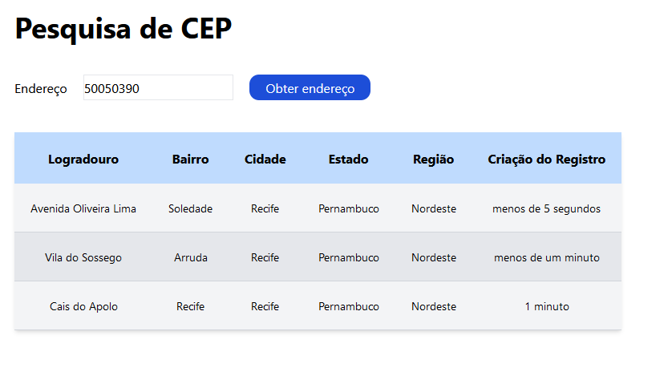

# Busca CEP

Repositório com projeto Busca CEP, uma aplicação que consome a API viaCEP para pegar os dados de um cep e mostrar em uma tabela o logradouro, a cidade, o estado e a região do endereço.

## Visualize o Projeto



## Funcionalidades

- Click do botão: ao clicar no botão com o input preenchido, a aplicação faz uma requisição para a API que retorna os dados do endereço vinculados ao número do CEP.

## Para rodar o projeto no seu computador:

- Para clonar o repositório:

```bash
  git clone https://github.com/cabarros3/busca-de-cep.git
```

- Instale as dependências:

```bash
  npm install
```

- Compile e Inicie o Projeto:

```bash
  npm run dev
```

## Tecnologias Utilizadas

- **HTML**: Estruturação da página.
- **CSS**: Estilização do layout e design responsivo.
- **TypeScript**: Lógica da aplicação e definição de tipos.
- **React**: biblioteca.
- **Next**: Ferramenta de build e desenvolvimento.
- **viaCEP**: API.

**_Entre em contato comigo_**

- **LinkedIn**: [Camilla Barros](https://www.linkedin.com/in/camillabarros/)
